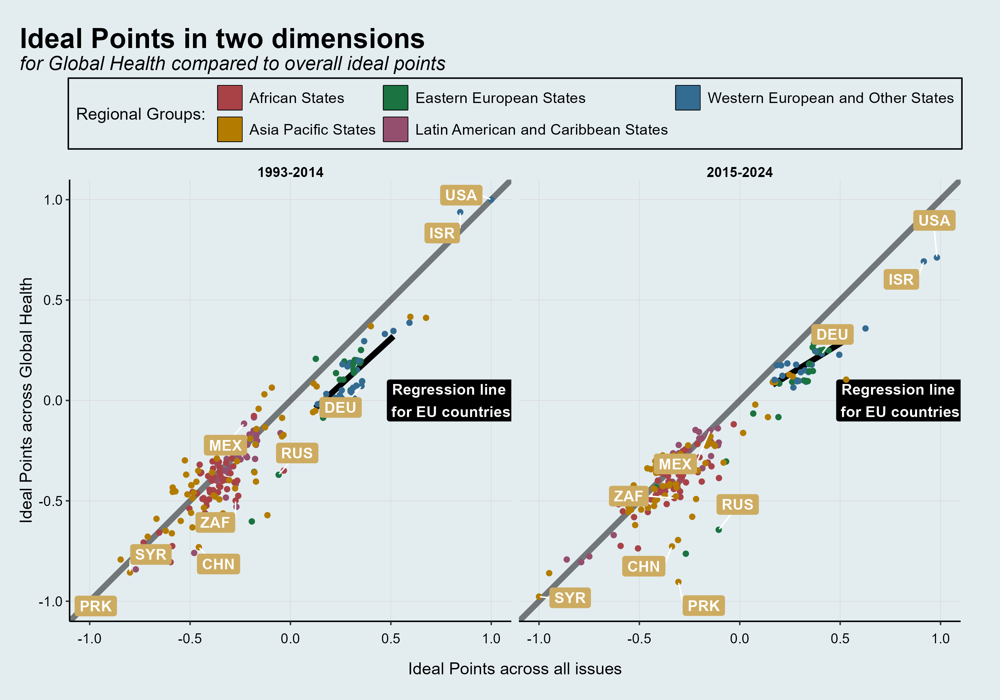

<!-- README.md is generated from README.Rmd. Please edit that file -->

### Replication for: Shifting Alliances. Analyzing Co-Voting based on a new classification of issue areas in the United Nations General Assembly

<!-- badges: start -->
<!-- badges: end -->

The here uploaded code contains all code to clean data, run the analysis
and generate the resulting graphs for the above mentioned article. The
dataset itself is currently unpublished, as we are still working on the
first paper, but will be made available soon after.

